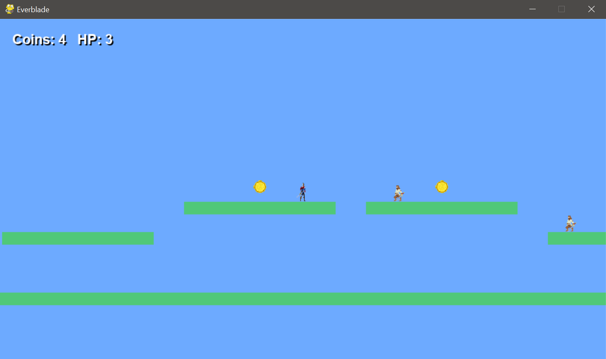

# (Jogo) Everblade | Python

Trabalho para a disciplina de Linguagem de Programação Aplicada com o objetivo de desenvolver uma versão demo de um jogo 2D em Python (pygame). 

 

## Funcionalidades principais

<ul>
    <li>
        Movimentação do jogador:
        <ul>
            <li>Implementado na classe 'Player' (entities.py);</li>
            <li>Controles: andar (A/D ou ←/→) e pular (Espaço/W/↑);</li>
            <li>Física simples: gravidade, colisão com plataformas e limites de velocidade vertical.</li>
        </ul>
    </li>
    <li>
        Plataformas sólidas (Tiles):
        <ul>
            <li>Criadas a partir do LEVEL_MAP em level.py usando a classe Tile (tiles.py);</li>
            <li>Colocadas em matriz de caracteres (X) que representam blocos sólidos;</li>
            <li>Altura ajustada para caber no salto do player.</li>
        </ul>
    </li>
    <li>
        Inimigos (Enemy):
        <ul>
            <li>Um inimigo por plataforma, gerado automaticamente após a construção do nível (level.py);</li>
            <li>São derrotados se o player cair em cima deles (stomp);</li>
            <li>Causam dano se encostarem lateralmente no player.</li>
        </ul>
    </li>
    <li>
        Sistema de vida (Health):
        <ul>
            <li>Player inicia com 3 pontos de vida;</li>
            <li>Cada colisão lateral com inimigo remove 1 HP (com 0,7s de invencibilidade);</li>
            <li>Quando chega a 0, aparece mensagem “Game Over – Press R to restart”.</li>
        </ul>
    </li>
    <li>
        Condição de vitória:
        <ul>
            <li>Ao derrotar todos os inimigos, aparece a mensagem “You won! Press R to restart”;</li>
        </ul>
    </li>
    <li>
        Câmera com scroll lateral:
        <ul>
            <li>Implementada em CameraGroup (level.py);</li>
            <li>Centraliza a visão no player, permitindo mapas maiores que a tela;</li>
            <li>Desenha sprites com deslocamento baseado na posição do jogador.</li>
        </ul>
    </li>
</ul>

 

  

